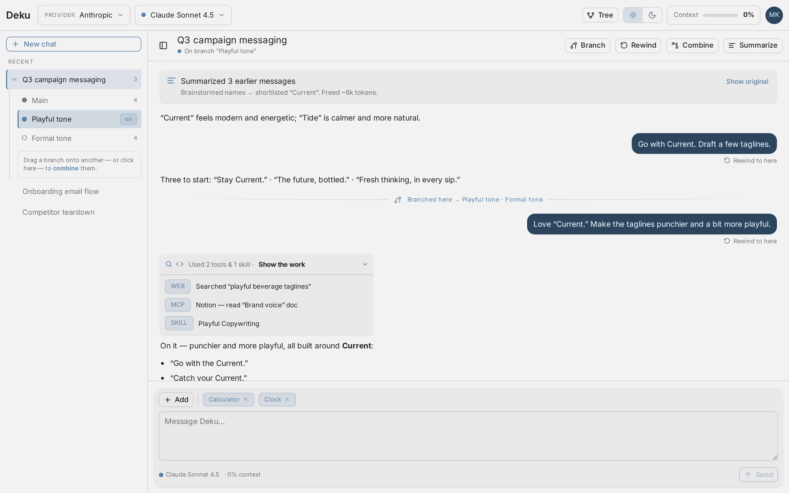
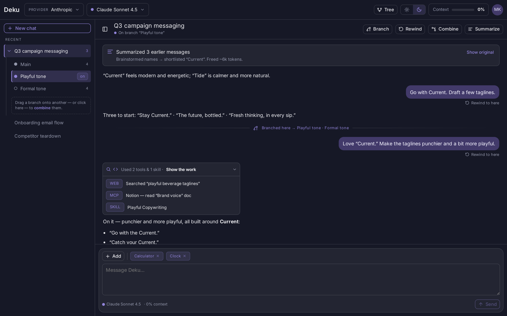
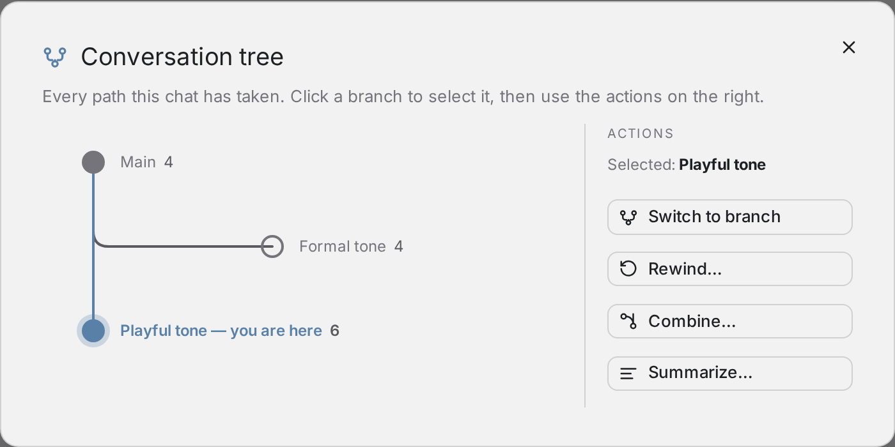
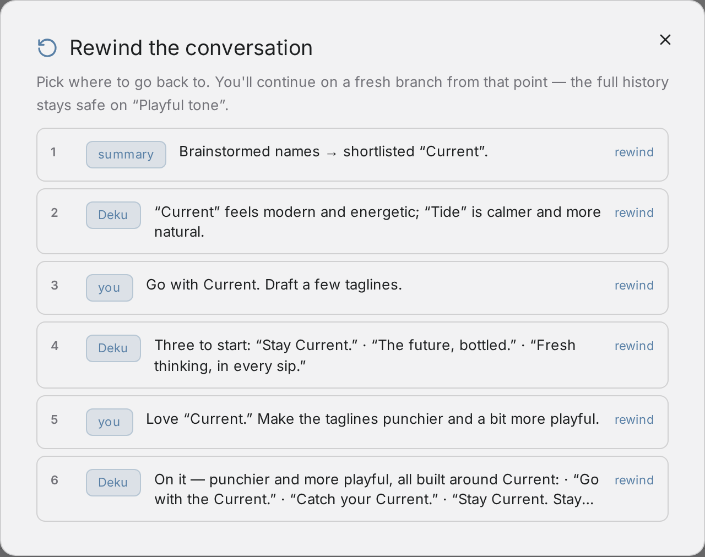
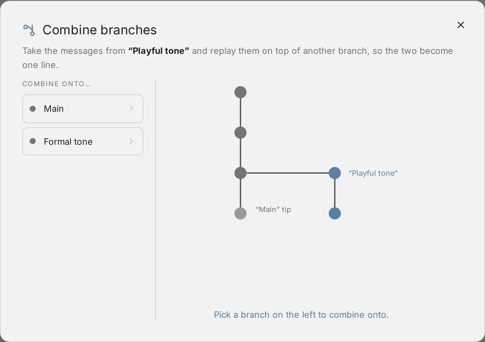
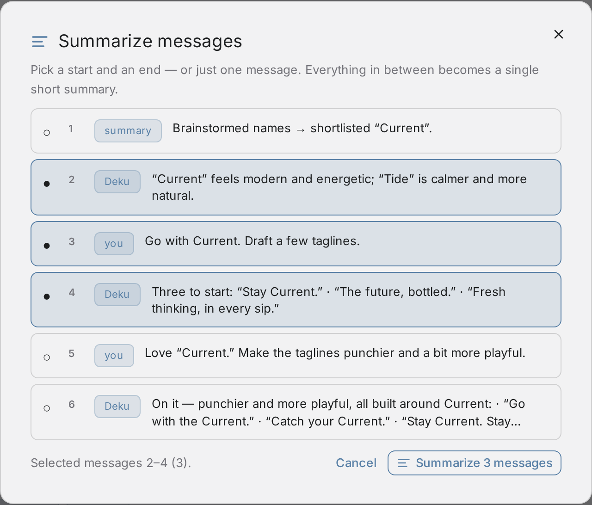
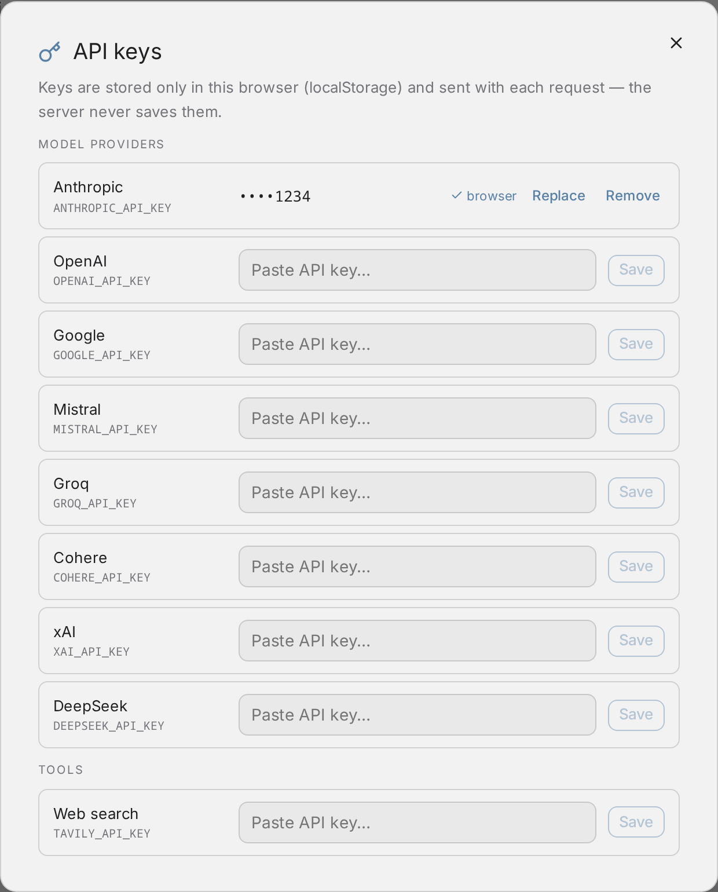

# Deku — agentic chat with branching conversations




<details>
<summary>Dark theme</summary>



</details>

A standalone webapp implementing the `Agentic Chat.dc.html` design from the Claude Design handoff
(`design-handoff/`). Conversations are trees: you can **branch** to explore directions, **rewind**
to any earlier message (the later messages stay safe on the old branch), **combine** one branch
onto another, and **summarize** message ranges to reclaim context.

## Features

### Conversation tree



Every path the chat has taken, laid out as a git-style graph: the solid neutral node is the root,
hollow rings are branches you can jump to, and the accent node marks where you are. Click a node
to select it, then switch to it or launch rewind / combine / summarize against it. The rail to
your current branch is drawn in the accent color.

### Rewind



Pick any earlier message and continue from there on a fresh `Rewind N` branch — the messages
after that point are never deleted, they stay on the branch you rewound from. The rows below
your pick animate away before the rewind commits. Every user bubble also has a "Rewind to here"
shortcut that opens this modal with that message preselected.

### Combine



Replays the current branch's messages on top of another branch so two explorations become one
line — the animation lifts the branch's commits off the fork point and winds them onto the
target's tip. You can also trigger it by dragging one branch onto another in the sidebar.
Afterwards the source branch is removed and any of its children are re-pointed at the target.

### Summarize



Select a start and end message (or a single message) and the range is compressed into one short
summary node by the current model. The summary card in the transcript shows what was freed and
keeps the originals behind a "Show original" toggle — nothing is destroyed. Also reachable via
"Compact conversation" in the context meter.

### API keys



Click (or right-click) the avatar → **API keys…**. One row per supported provider — Anthropic,
OpenAI, Google, Mistral, Groq, Cohere, xAI, DeepSeek — plus tool keys like Tavily web search.
Keys live in your browser's localStorage only and are sent per-request; the server never stores
them. Saved keys show masked with a "browser" source tag.

## Stack

- **Frontend** — React 18 + Vite + TypeScript. Themes are the design system's `scope-industry`
  (light) and `scope-nocturne` (dark) scopes, copied verbatim into `src/styles/theme.css`.
- **Backend** — Node + Express (`server/`). The LLM side is a **LangGraph JS** ReAct agent
  (`createReactAgent`) with pluggable providers: Anthropic, OpenAI, Google Gemini, Mistral,
  Groq, Cohere, xAI, and DeepSeek.
- **Tools** — calculator and clock (always available), web search via Tavily (optional key).
  Tool calls stream into the "Show the work" disclosure on each assistant message.
  (The design's "Tools / Skills / Connectors (MCP) / Files" composer menu is intentionally
  simplified to a flat capability list until skills/MCP/files land; the tool-event model
  already carries `mcp`/`skill` kinds for when they do.)
- **Persistence** — JSON file at `server/data/db.json` (created on first write).
- **Streaming** — NDJSON over a fetch stream (`delta` / `tool` / `done` / `error` events).

## Setup

```bash
npm install
cp .env.example .env   # add at least one provider key
npm run dev            # server on :5175, web on :5173 (proxied)
```

Open http://localhost:5173.

Production: `npm run build && npm start` (serves the built app on :5175).

## API keys

Two ways to provide keys, in priority order:

1. **In the app (recommended)** — click the avatar in the top right → **API keys…**.
   Keys are stored in your **browser's localStorage only**, sent with each request, and never
   persisted by the server.
2. **Server `.env` fallback** — `ANTHROPIC_API_KEY`, `OPENAI_API_KEY`, `GOOGLE_API_KEY`,
   `MISTRAL_API_KEY`, `GROQ_API_KEY`, `COHERE_API_KEY`, `XAI_API_KEY`, `DEEPSEEK_API_KEY`,
   plus optional `TAVILY_API_KEY` (enables the "Web search" tool) and `PORT` (default 5175).

Providers without a key from either source show as "no key" in the provider menu; chat requests
against them return a friendly error. Summarize falls back to a naive first-line summary if no
LLM is reachable.

## How branching is modeled

Each branch stores its **full message list** (copy-on-branch) plus `forkOf: {branchId, messageId}`
pointing at where it diverged. That makes every operation simple:

- **Branch** — copy the active branch, switch to the copy.
- **Rewind to message N** — copy the prefix up to N into a new `Rewind k` branch and switch to it;
  the original branch keeps the later messages.
- **Combine A → B** — append A's messages that B doesn't already have (by id) onto B, re-point
  A's children at B, delete A.
- **Summarize range** — replace the range with a single `summary` node that keeps the originals
  (`summaryOf`) for "Show original", and counts freed tokens toward the context meter.

The context meter estimates tokens (~4 chars/token) across system prompt, enabled tools,
conversation, and summaries against the selected model's context window.
